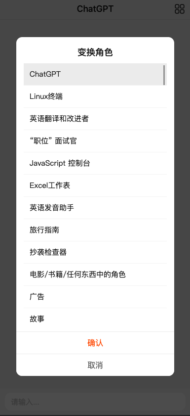
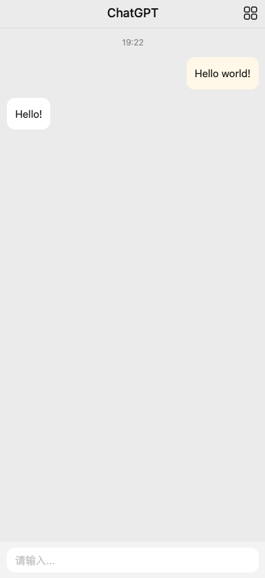

This project is developed based on other excellent projects on Github, including but not limited to:

- [nextjs](https://github.com/vercel/next.js)
- [chatgpt-api](https://github.com/transitive-bullshit/chatgpt-api)
- [awesome-chatgpt-prompts](https://github.com/f/awesome-chatgpt-prompts)

Thanks to the selfless contributions of these developers.

## Features

- Support multiple OpenAPI keys by creating multiple ChatAPI clients for load balancing
- Supports conversation
- Supports switching of assistant role
- Supports PC/Mobile devices
- Custom OpenAI API
- [ ] TODO: Persistent conversation
- [ ] TODO: Supports login




## Getting Started

If you want to experience it directly, you can visit [ai-assistant demo](https://ai.gonote.io). (If you find that it is unable to answer, it might be because the key balance is insufficient, you can raise an issue)

### Deploy with vercel

[](https://vercel.com/new/clone?repository-url=https%3A%2F%2Fgithub.com%2Fyouking-lib%2Fai-assistant&env=OPENAI_API_KEY&envDescription=OpenAI%20API%20Key)

### Deploy with pm2

prerequisites

- nodejs
- npm
- ensure your server can access api.openai.com

```shell
ping ai.openai.com
curl https://api.openai.com # re 'Invalid URL (GET /)' message means ok.
```

1. clone `ai-assistant`

```bash
git clone https://github.com/youking-lib/ai-assistant.git
npm i -g pnpm pm2
```

2. add `.env` file

```bash
# SITE_GOOGLE_ANALYTICS=
# Supports multi API_KEY, split with ','
OPENAI_API_KEY=KEY_1,KEY_2
```

3. deploy

```
sh deploy.sh
```

### Deploy with docker

```bash
# TODO
```

### Local

Same as `deploy with pm2`：

- Clone this project.
- Add the .env file (or .env.local for development purposes, which will not be committed).
- Run the following script:

```
pnpm i
pnpm run dev
```

The server has started and is now running on localhost at port 3000.
